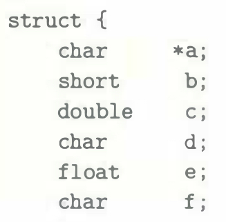
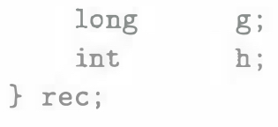

# Practice Problem 3.45 (solution page 345)
Answer the following for the structure declaration

A. What are the byte offsets of all the fields in the structure?

B. What is the total size of the structure?

C. Rearrange the fields of the structure to minimize wasted space, and then show the byte offsets and total size for the rearranged structure.
