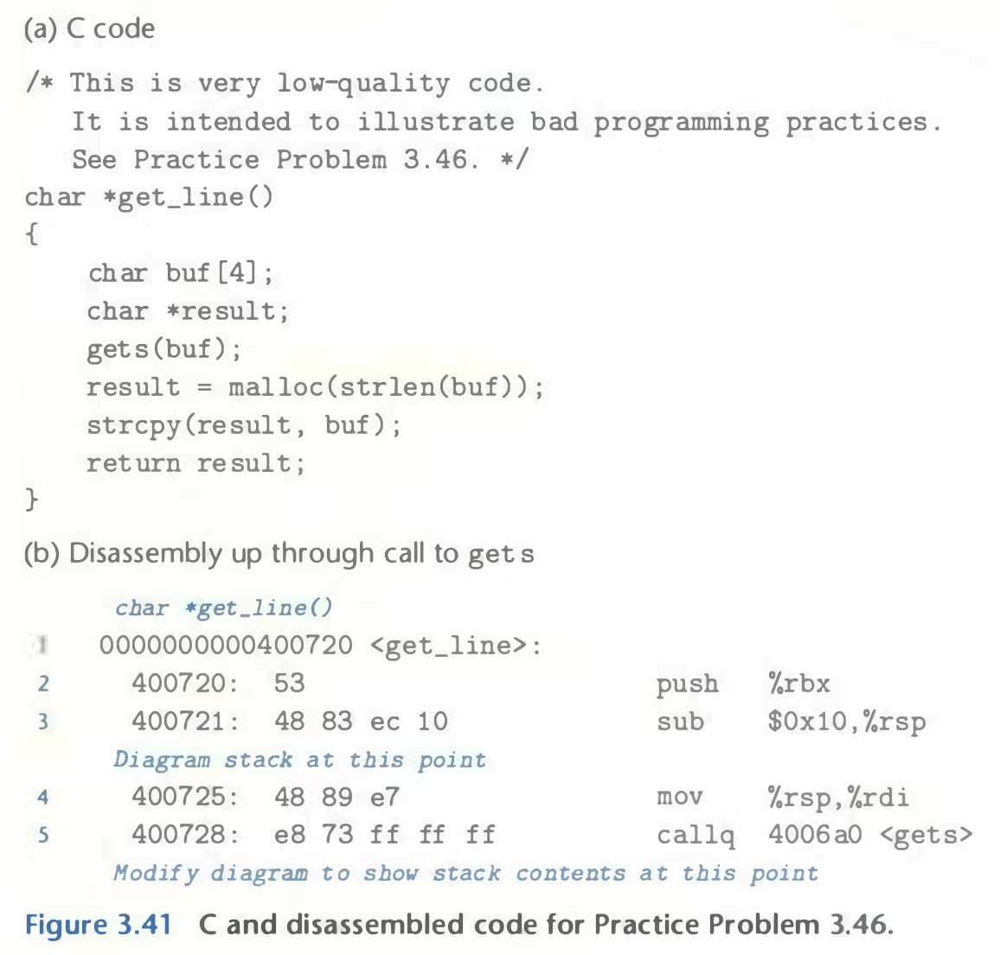
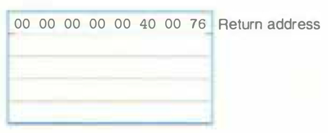

# Practice Problem 3.46 (solution page 346)
Figure 3.41 shows a (low-quality) implementation of a function that reads a line from standard input, copies the string to newly allocated storage, and returns a pointer to the result.



Consider the following scenario. Procedure `get_line` is called with return address `0x400776` and register `%rbx` equal to `0x0123456789ABCDEF`. You type in the string

```
0123456789012345678901234
```

The program terminates with a segmentation fault. You run `GDB` and determine that the error occurs during the execution of the `ret` instruction of `get_line`.

A. Fill in the diagram that follows, indicating as much as you can about the stack just after executing the instruction at line 3 in the disassembly. Label the quantities stored on the stack (e.g., "Return address") on the right, and their hexadecimal values (if known) within the box. Each box represents 8 bytes.
Indicate the position of `%rsp`. Recall that the ASCIl codes for characters 0-9 are `0x30`—`0x39`.



B. Modify your diagram to show the effect of the call to `gets` (line 5).

C. To what address does the program attempt to return?

D. What register(s) have corrupted value(s) when `get_line` returns?

E. Besides the potential for buffer overflow, what two other things are wrong with the code for `get_line`?