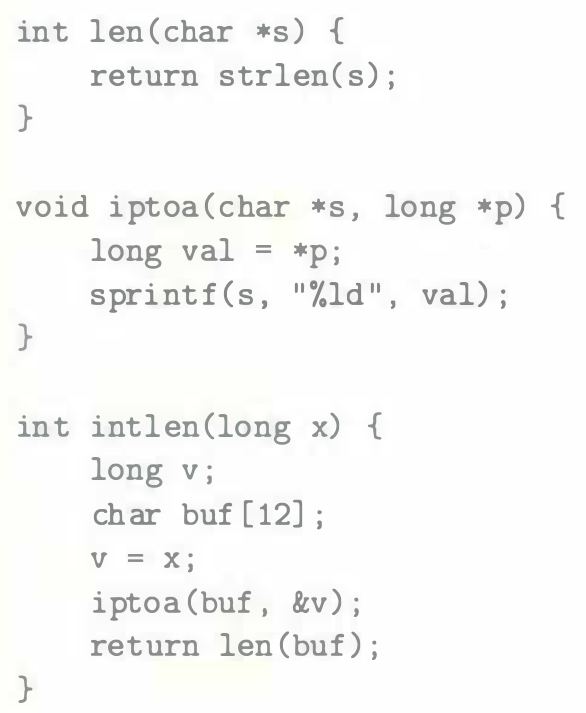
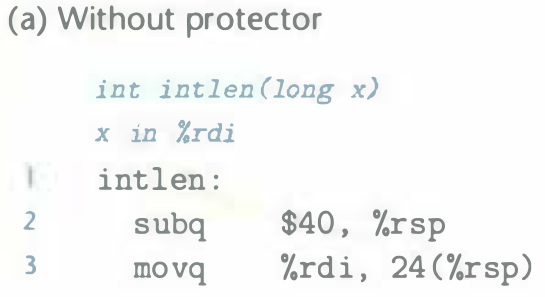
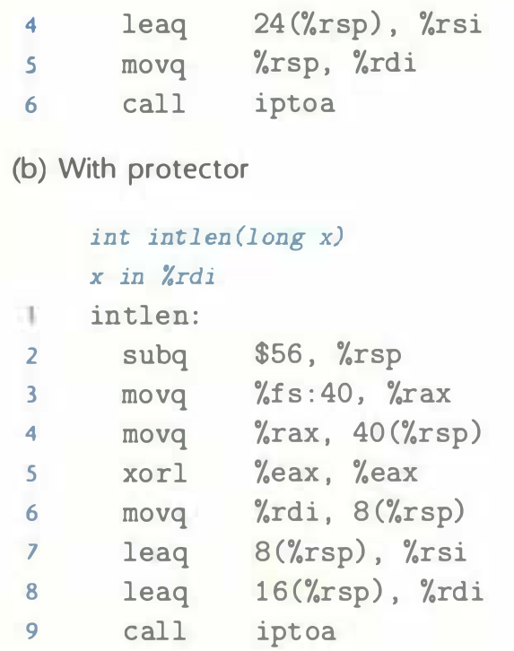

# Practice Problem 3.48 (solution page 347)
The functions `intlen`, `len`, and `iptoa` provide a very convoluted way to compute the number of decimal digits required to represent an integer. We will use this as a way to study some aspects of the `GCC` stack protector facility.

The following show portions of the code for `intlen`, compiled both with and
without stack protector:

A. For both versions: What are the positions in the stack frame for `buf`, `v`, and (when present) the canary value?

B. How does the rearranged ordering of the local variables in the protected code provide greater security against a buffer overrun attack?