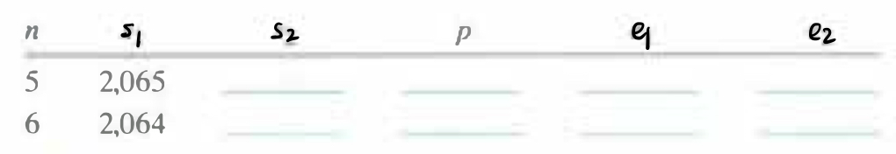

# Practice Problem 3.49 (solution page 347)
In this problem, we will explore the logic behind the code in lines 5-11 of Figure 3.43(b), where space is allocated for variable-size array `p`. As the annotations of the code indicate, let us let $s_1$, denote the address of the stack pointer after executing the `subq` instruction of line 4. This instruction allocates the space for local variable `i`. Let $s_2$ denote the value of the stack pointer after executing the `subq` instruction of line 7. This instruction allocates the storage for local array `p`. Finally, let $p$ denote the value assigned to registers `%r8` and `%rcx` in the instructions of lines 10-11. Both of these registers are used to reference array `p`.

The right-hand side of Figure 3.44 diagrams the positions of the locations indicated by $s_1$, $s_2$, and $p$. It also shows that there may be an offset of $e_2$ bytes between the values of $s_2$ and $p$. This space will not be used. There may also be an offset of $e_1$ bytes between the end of array `p` and the position indicated by $s_1$.

A. Explain, in mathematical terms, the logic in the computation of $s_2$ on lines 5-7. **Hint**: Think about the bit-level representation of -16 and its effect in the `andq` instruction of line 6.

В. Explain, in mathematical terms, the logic in the computation of $p$ on lines 8-10. **Hint**: You may want to refer to the discussion on division by powers of 2 in Section 2.3.7

C. For the following values of $n$ and $s_1$, trace the execution of the code to determine what the resulting values would be for $s_2$, $p$, $e_1$, and $e_2$.

D. What alignment properties does this code guarantee for the values of $s_2$ and $p$?

## Solution:

16: 00...010000

-16: 11...110000

line 5: rax: 8n + 22

line 6: set low 4 bits to 0

line 8: rax: rsp + 7

line 9: rax >> 3