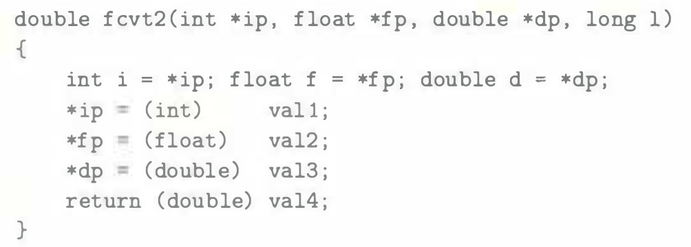
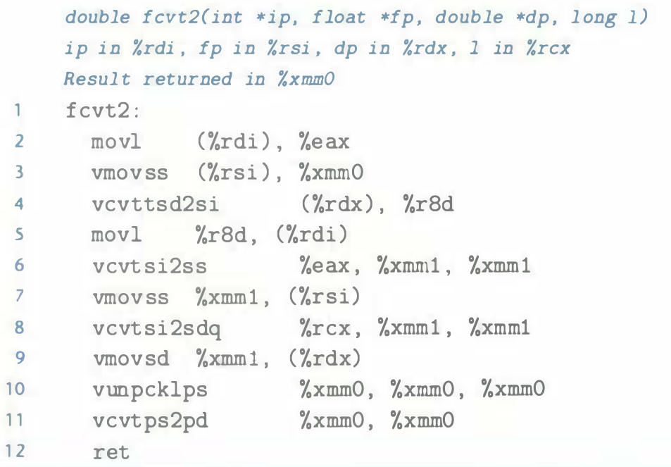

# Practice Problem 3.50 (solution page 347)
For the following C code, the expressions `val1`-`val4` all map to the program values `i`, `f`, `d`, and `l`:

Determine the mapping, based on the following x86-64 code for the function:

