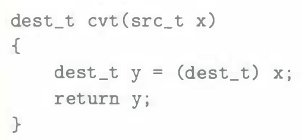
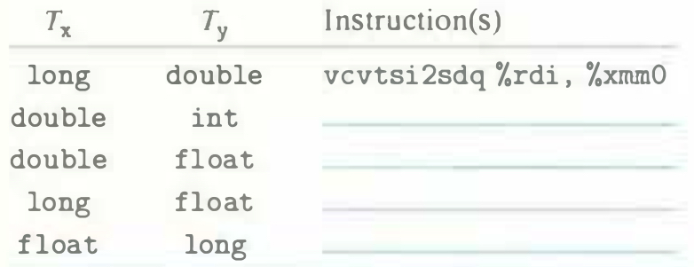

# Practice Problem 3.51 (solution page 348)
The following C function converts an argument of type `src_t` to a return value of type `dest_t`, where these two types are defined using `typedef`:

For execution on x86-64, assume that argument `x` is either in `%xmm0` or in the appropriately named portion of register `%rdi` (i.e., `%rdi` or `%edi`). One or two instructions are to be used to perform the type conversion and to copy the value to the appropriately named portion of register `%rax` (integer result) or `%xmm0` (floating-point result). Show the instruction(s), including the source and destination registers.

