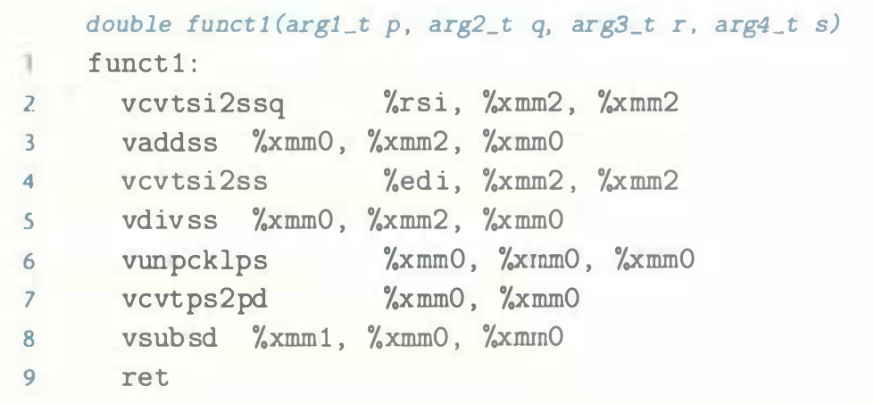

# Practice Problem 3.53 (solution page 348)
For the following C function, the types of the four arguments are defined by `typedef`:

```c
double funct1(arg1_t p, arg2_t q, arg3_t r, arg4_t s)
{
    return p/(q+r) - s;
}
```

When compiled, `GCC` generates the following code:



Determine the possible combinations of types of the four arguments (there
may be more than one).