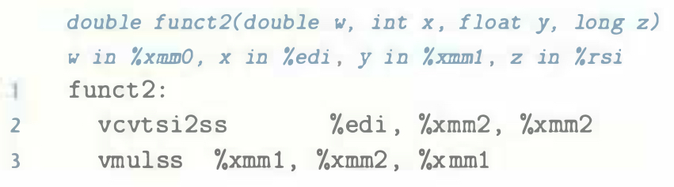
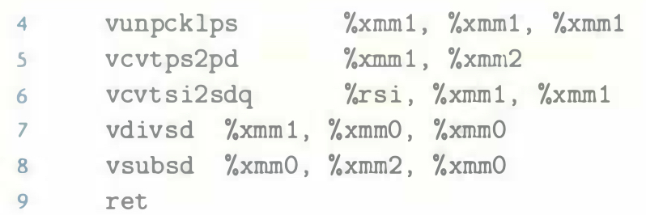

# Practice Problem 3.54 (solution page 349)
Function `funct2` has the following prototype:

```c
double funct2(double w, int x, float y, long z);
```

`GCC` generates the following code for the function:





Write a C version of `funct2`.