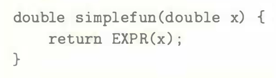
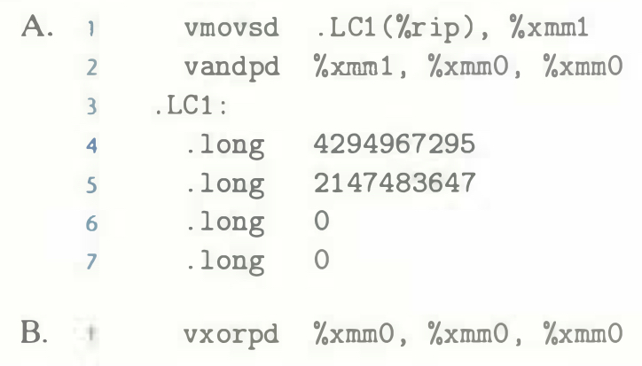
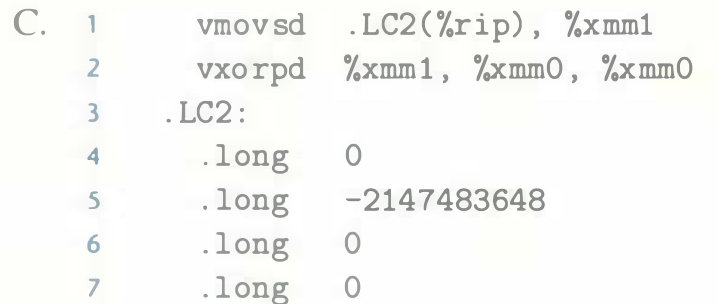

# Practice Problem 3.56 (solution page 350)
Consider the following C function, where `EXPR` is a macro defined with `#define`:

Below we show the AVX2 code generated for different definitions of `EXPR`, where value `x` is held in `%xmm0`. All of them correspond to some useful operation on floating-point values. Identify what the operations are. Your answers will require you to understand the bit patterns of the constant words being retrieved from memory.

