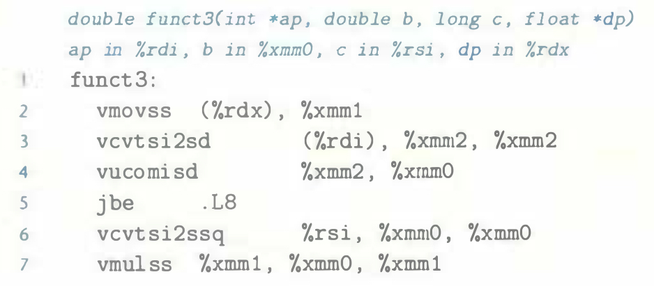

# Practice Problem 3.57 (solution page 350)
Function `funct3` has the following prototype:

```c
double funct3(int *ap, double b, long c, float *dp);
```

For this function, `GCC` generates the following code:




Write a C version of `funct3`.