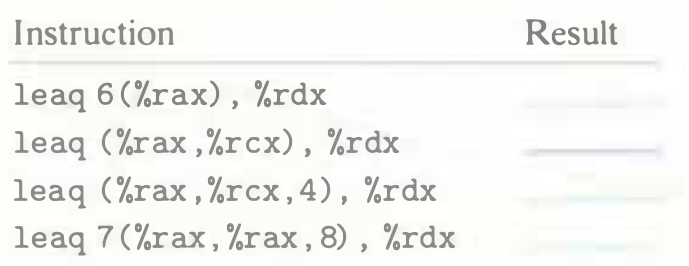

# Practice Problem 3.6 (solution page 327)
Suppose register `%rax` holds value $x$ and `%rcx` holds value $y$. Fill in the table below with formulas indicating the value that will be stored in register `%rdx` for each of the given assembly-code instructions:

