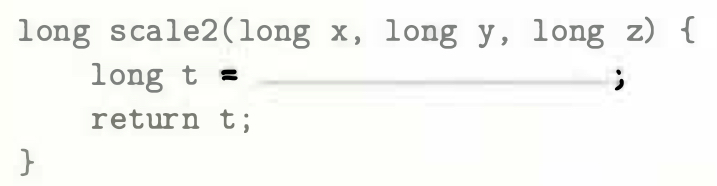
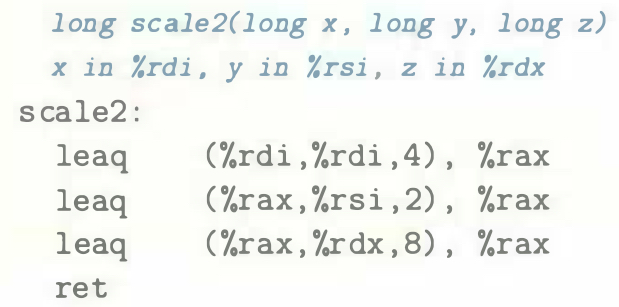

# Practice Problem 3.7 (solution page 328)
Consider the following code, in which we have omitted the expression being computed:

Compiling the actual function with `GCC` yields the following assembly code:

Fill in the missing expression in the C code.