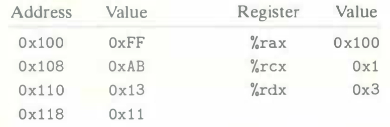
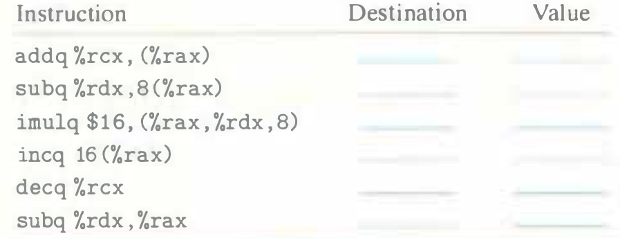

# Practice Problem 3.8 (solution page 328)
Assume the following values are stored at the indicated memory addresses and registers:

Fill in the following table showing the effects of the following instructions, in terms of both the register or memory location that will be updated and the resulting value:

