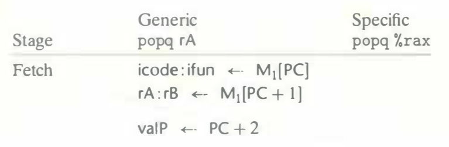
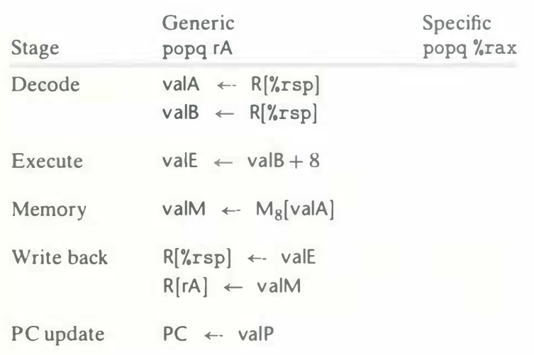

# Practice Problem 4.14 (solution page 486)
Fill in the right-hand column of the following table to describe the processing of
the `popq` instruction on line 7 of the object code in Figure 4.17. 

What effect does this instruction execution have on the registers and the PC?

## Solution:

- The address of `popq %rax` is `0x02c`
- The value of `%rsp` is 120
- The value at memory location `%rsp` is 9

|Stage|Generic `popq rA`|Specific `popq %rax`|
|-|-|-|
|Fetch|icode : ifun $\leftarrow$ $M_1$[PC]|icode: ifun $\leftarrow$ $M_1$[0x02c] = b : 0|
||rA : rB $\leftarrow$ $M_1$[PC + 1]|rA : rB $\leftarrow$ $M_1$[0x02d] = 0 : f|
||valP $\leftarrow$ PC + 2|valP $\leftarrow$ 0x02c + 2 = 0x02e|
|Decode|valA $\leftarrow$ R[%rsp]|valA $\leftarrow$ R[%rsp] = 120|
||valB $\leftarrow$ R[%rsp]|valB $\leftarrow$ R[%rsp] = 120|
|Execute|valE $\leftarrow$ valB + 8|valE $\leftarrow$ 120 + 8 = 128|
|Memory|valM $\leftarrow$ $M_8$[valA]|valM $\leftarrow$ $M_8$[120] = 9|
|Write back|R[%rsp] $\leftarrow$ valE|R[%rsp] $\leftarrow$ valE = 128|
||R[rA] $\leftarrow$ valM|R[rA] $\leftarrow$ valM = 9|
|PC update|PC $\leftarrow$ valP|PC $\leftarrow$ valP = 0x02e|

- Increment `%rsp` by 8 to 128, and assign value 9 to register `%rax`
- Increment PC by 2