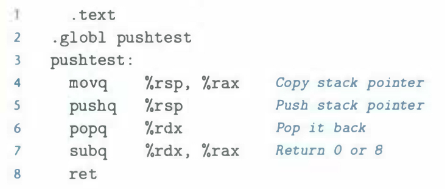

# Practice Problem 4.7 (solution page 484)

Let us determine the behavior of the instruction `pushq %rsp` for an x86-64 pro­ cessor. We could try reading the Intel documentation on this instruction, but a simpler approach is to conduct an experiment on an actual machine. The C compiler would not normally generate this instruction, so we must use hand-generated assembly code for this task. Here is a test function we have written (Web Aside ASM:EASM on page 178 describes bow to write programs that combine C code with handwritten assembly code):

In our experiments, we find that function `pushtest` always returns `0`. What does this imply about the behavior of the instruction `pushq %rsp` under x86-64?

## Solution

This implies `pushq %rsp` pushes the original `%rsp` value to the stack not decremented value
