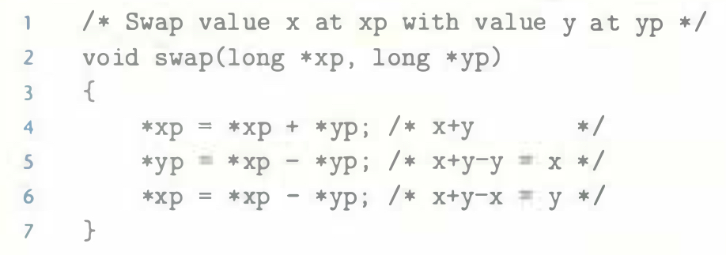

# Practice Problem 5.1 (solution page 573)
The following problem illustrates the way memory aliasing can cause unexpected program behavior. Consider the following procedure to swap two values:

If this procedure is called with xp equal to yp. what effect will it have?