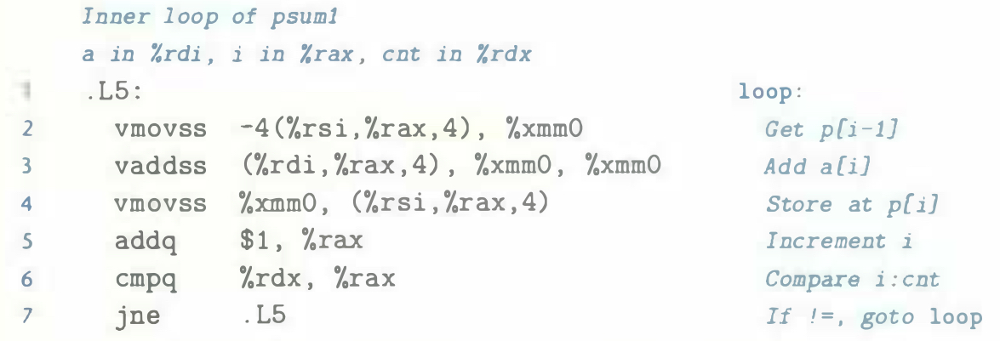

# Practice Problem 5.11 (solution page 577)
We saw that our measurements of the prefix-sum function `psum1` (Figure 5.1) yield a CPE of 9.00 on a machine where the basic operation to be performed, floating-point addition, has a latency of just 3 clock cycles. Let us try to understand why our function performs so poorly.

The following is the assembly code for the inner loop of the function:

Perform an analysis similar to those shown for `combine3` (Figure 5.14) and for `write_read` (Figure 5.36) to diagram the data dependencies created by this loop, and hence the critical path that forms as the computation proceeds. Explain why the CPE is so high.