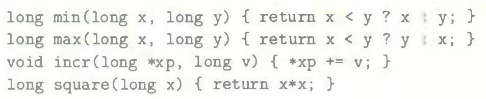
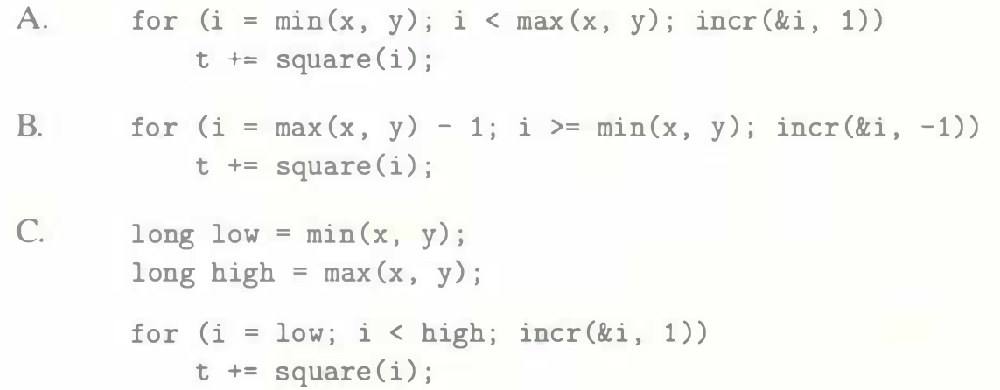
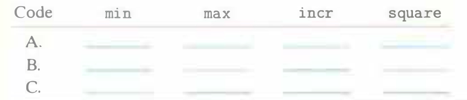

# Practice Problem 5.3 (solution page 573)
Consider the following functions:

The following three code fragments call these functions:

Assume `x` equals 10 and `y` equals 100. Fill in the following table indicating the number of times each of the four functions is called in code fragments A-C:

