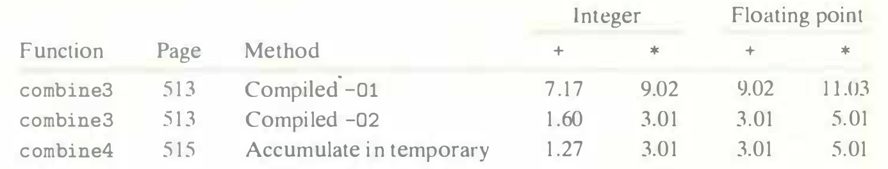
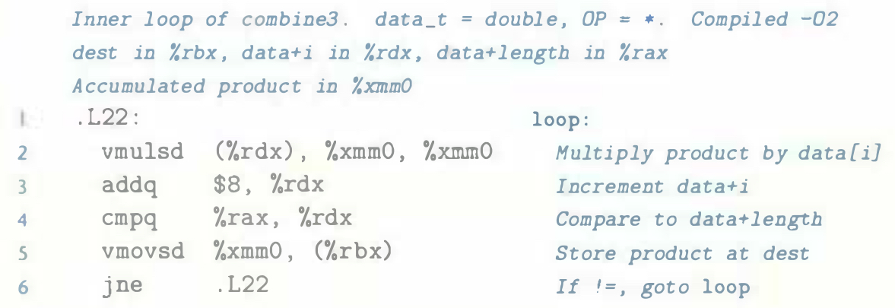
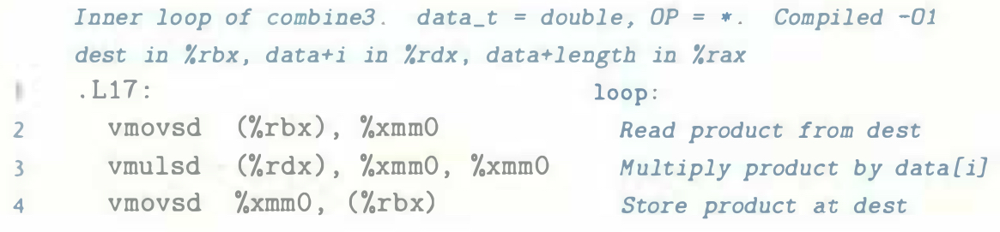
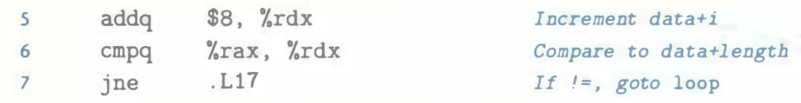

# Practice Problem 5.4 (solution page 574)
When we use `GCC` to compile `combine3` with command-line option `-O2`, we get code with substantially better CPE performance than with `-O1`:

We achieve performance comparable to that for `combine4`, except for the case of integer sum, but even it improves significantly. On examining the assembly code generated by the compiler, we find an interesting variant for the inner loop:

We can compare this to the version created with optimization level 1:

We see that, besides some reordering of instructions, the only difference is that the more optimized version does not contain the `vmovsd` implementing the read from the location designated by `dest` (line 2)

A. How does the role of register `%xmm0` differ in these two loops?

B. Will the more optimized version faithfully implement the C code of `combine3`, including when there is memory aliasing between `dest` and the vector data?

C. Either explain why this optimization preserves the desired behavior, or give an example where it would produce different results than the less optimized code.