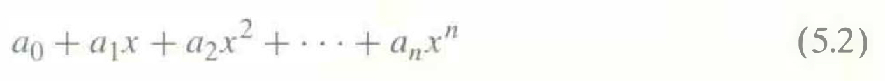
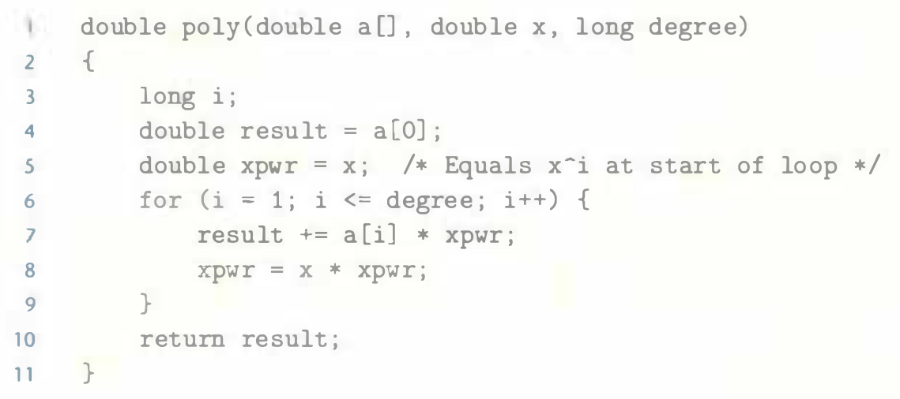

# Practice Problem 5.5 (solution page 575)
Suppose we wish to write a function to evaluate a polynomial, where a polynomial of degree $n$ is defined to have a set of coefficients $a_0, a_1, a_2, \dots, a_n$. For a value $x$, we evaluate the polynomial by computing

This evaluation can be implemented by the following function, having as arguments an array of coefficients `a`, a value `x`, and the polynomial degree `degree` (the value $n$ in Equation 5.2). In this function, we compute both the successive terms of the equation and the successive powers of $x$ within a single loop:

A. For degree $n$, how many additions and how many multiplications does this code perform?

B. On our reference machine, with arithmetic operations having the latencies shown in Figure 5.12, we measure the CPE for this function to be 5.00. Explain how this CPE arises based on the data dependencies formed between iterations due to the operations implementing lines 7-8 of the function.