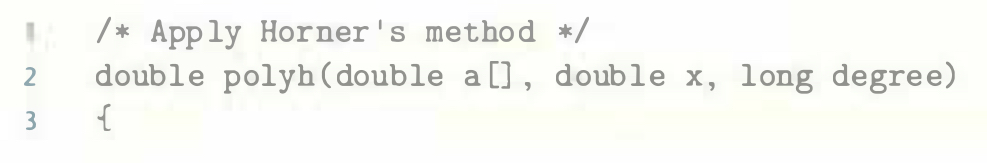

# Practice Problem 5.6 (solution page 575)
Let us continue exploring ways to evaluate polynomials, as described in Practice Problem 5.5. We can reduce the number of multiplications in evaluating a polynomial by applying **Horner's method**, named after British mathematician William G.
Horner (1786-1837). The idea is to repeatedly factor out the powers of $x$ to get the following evaluation:

Using Horner's method, we can implement polynomial evaluation using the following code:

A. For degree $n$, how many additions and how many multiplications does this code perform?

B. On our reference machine, with the arithmetic operations having the latencies Shown in Figure 5.12, we measure the CPE for this function to be 8.00. Explain how this CPE arises based on the data dependencies formed between iterations due to the operations implementing line 7 of the function.

C. Explain how the function shown in Practice Problem 5.5 can run faster, even though it requires more operations.