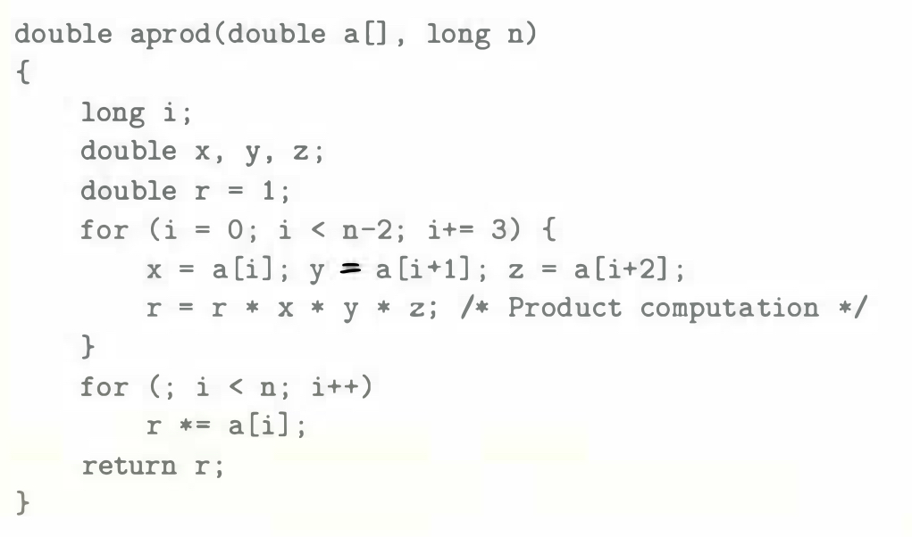
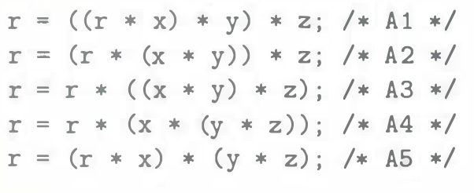

# Practice Problem 5.8 (solution page 576)
Consider the following function forcomputing the product of an array of $n$ double-precision numbers. We have unrolled the loop by a factor of 3.

For the line labeled "Product computation," we can use parentheses to create five different associations of the computation, as follows:

Assume we run these functions on a machine where floating-point multiplication has a latency of 5 clock cycles. Determine the lower bound on the CPE set by the data dependencies of the multiplication. (Hint: It helps to draw a data-flow representation of how `r` is computed on every iteration.)