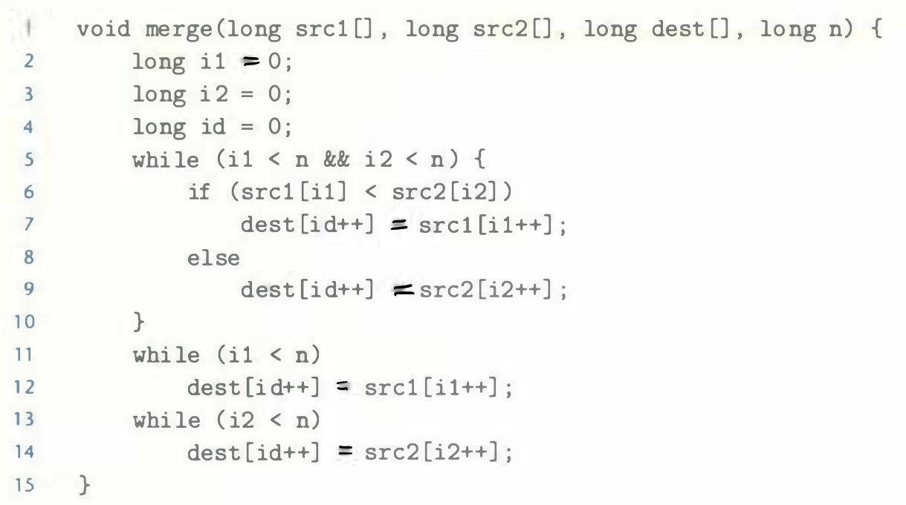

# Practice Problem 5.9 (solution page 576)
The traditional implementation of the merge step of mergesort requires three loops [98]:

The branches caused by comparing variables `i1` and `i2` to `n` have good prediction performance--the only mispredictions occur when they first become false. The comparison between values `src1[i1]` and `src2[i2]` (line 6), on the other hand, is highly unpredictable for typical data. This comparison controls a conditional branch, yielding a CPE (where the number of elements is $2n$) of around 15.0 when run on random data.

Rewrite the code so that the effect of the conditional statement in the first loop (lines 6-9) can be implemented with a conditional move.