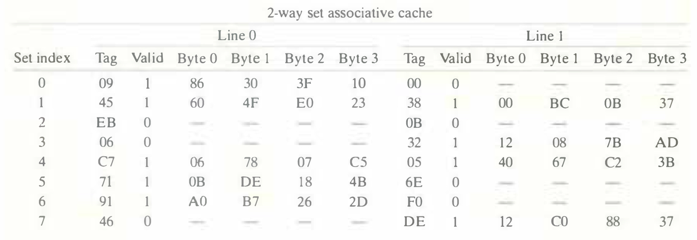
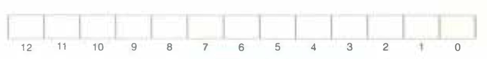

# Practice Problem 6.12 (solution page 663)
The problems that follow will help reinforce your understanding of how caches work. Assume the following:

- The memory is byte addressable
- Memory accesses are to 1-byte words (not to 4-byte words)
- Addresses are 13 bits wide
- The cache is two-way set associative ($E = 2$), with a 4-byte block size ($B = 4$) and eight sets ($S = 8$)

The contents of the cache are as follows, with all numbers given in hexadecimal notation.

The following figure shows the format of an address (1 bit per box). Indicate (by labeling the diagram) the fields that would be used to determine the following:

CO. The cache block offset

CI. The cache set index

CT. The cache tag

## Solution:

|12|11|10|9|8|7|6|5|4|3|2|1|0|
|-|-|-|-|-|-|-|-|-|-|-|-|-|
|CT|CT|CT|CT|CT|CT|CT|CT|CI|CI|CI|CO|CO|
