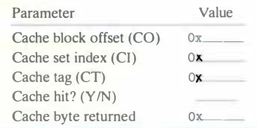

# Practice Problem 6.13 (solution page 664)
Suppose a program running on the machine in Problem 6.12 references the 1-byte word at address `0x0E34`. Indicate the cache entry accessed and the cache byte value returned in hexadecimal notation. Indicate whether a cache miss occurs. If there is a cache miss, enter "-" for "Cache byte returned."

A. Address format (1 bit per box):

B. Memory reference:

## Solution:

A.

|12|11|10|9|8|7|6|5|4|3|2|1|0|
|-|-|-|-|-|-|-|-|-|-|-|-|-|
|CT|CT|CT|CT|CT|CT|CT|CT|CI|CI|CI|CO|CO|
|0|1|1|1|0|0|0|1|1|0|1|0|0|

B.

|Parameter|Value|
|-|-|
|Cache block offset (CO)|`0x0`|
|Cache set index (CI)|`0x5`|
|Cache tag (CT)|`0x71`|
|Cache hit? (Y/N)|Y|
|Cache byte returned|`0x0B`|