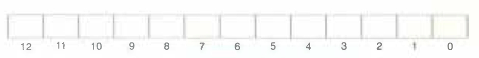

# Practice Problem 6.14 (solution page 664)
Repeat Problem 6.13 for memory address `0x0DD5`.

A. Address format (1 bit per box):

B. Memory reference:

## Solution:

A.

|12|11|10|9|8|7|6|5|4|3|2|1|0|
|-|-|-|-|-|-|-|-|-|-|-|-|-|
|CT|CT|CT|CT|CT|CT|CT|CT|CI|CI|CI|CO|CO|
|0|1|1|0|1|1|1|0|1|0|1|0|1|

B.

|Parameter|Value|
|-|-|
|Cache block offset (CO)|`0x1`|
|Cache set index (CI)|`0x5`|
|Cache tag (CT)|`0x6E`|
|Cache hit? (Y/N)|N|
|Cache byte returned|-|