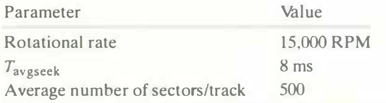

# Practice Problem 6.3 (solution page 661)
Estimate the average time (in ms) to access a sector on the following disk:

## Solution:
- For this disk, the average rotational latency (in ms) is

    $T_{avg \ rotation} = \frac{1}{2} \times T_{max \ rotation} 
    \\= \frac{1}{2} \times \frac{60secs}{15,000 RPM} \times \frac{1,000 ms}{sec}
    \\= 2 \ ms$

- The average transfer time is

    $T_{avg \ transfer} = \frac{60secs}{15,000 RPM} \times \frac{1}{500 \ sectors/track} \times \frac{1,000ms}{sec}
    \\= 0.008 \ ms$

- Putting it all together, the total estimated access time is:

    $T_{access} = T_{avg\ seek} + T_{avg \ rotation} + T {avg \ transfer} 
    \\= 8 ms + 2 ms + 0.008 ms
    \\= 10.008ms$