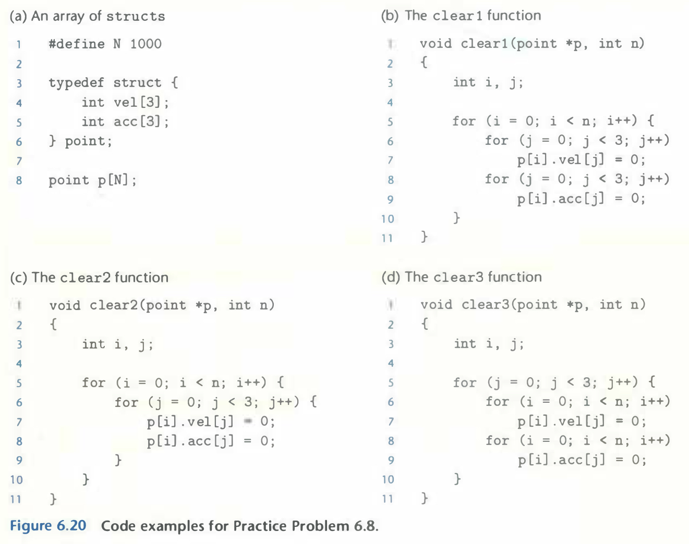
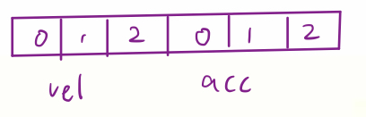

# Practice Problem 6.8 (solution page 663)
The three functions in Figure 6.20 perform the same operation with varying degrees of spatial locality. Rank-order the functions with respect to the spatial locality enjoyed by each. Explain how you arrived at your ranking.

## Solution:

- Answer: `clear1`, `clear2`, `clear3` from ~~high~~ best to ~~low~~ worst
- Based on the memory allocation of `p`
    - `clear2`: stride-1
    - `clear3`: stride-3
    - `clear4`: stride-6