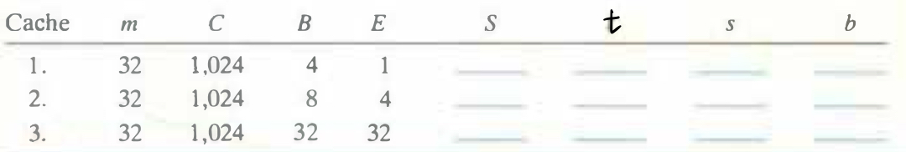

# Practice Problem 6.9 (solution page 663)
The following table gives the parameters for a number of different caches. For each cache, determine the number of cache sets (S), tag bits (t), set index bits (s), and block offset bits (b).

## Solution:

|Cache|m|C|B|E|S|t|s|b|
|-|-|-|-|-|-|-|-|-|
|1.|32|1,024|4|1|256|22|8|2|
|2.|32|1,024|8|4|32|24|5|3|
|3.|32|1,024|32|32|1|27|0|5|