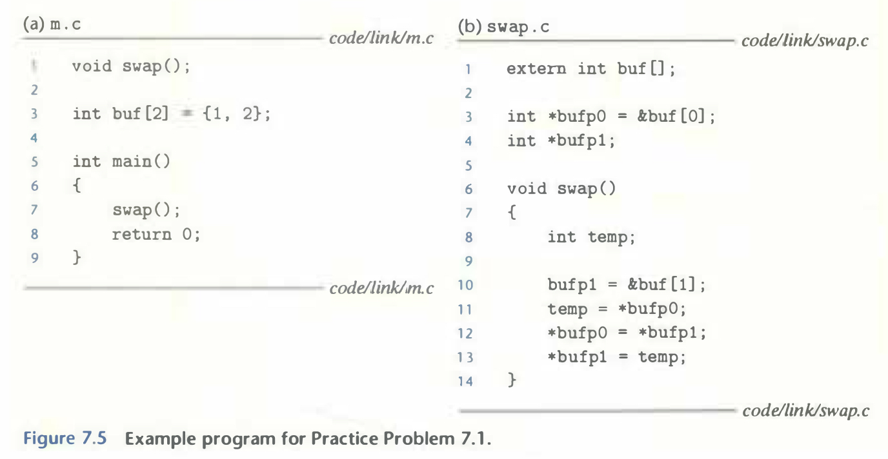
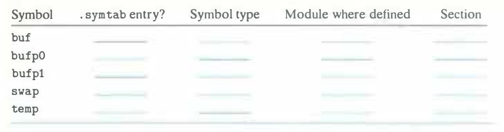

# Practice Problem 7.1 (solution page 717)
This problem concerns the `m.o` and `swap.o` modules from Figure 7.5. For each symbol that is defined or referenced in `swap.o`, indicate whether or not it will have a symbol table entry in the `.symtab` section in module `swap.o`. If so, indicate the module that defines the symbol(`swap.o` or `m.o` ), the symbol type(local, global, or extern), and the section (`.text`, `.data`, `.bss`, or `COMMON`) it is assigned to in the module.

## Solution:

|Symbol|`.symtab` entry?|Symbol type|Module where defined|Section|
|-|-|-|-|-|
|`buf`|Yes|extern|`m.o`|`.data`|
|`bufp0`|Yes|global|`swap.o`|`.data`|
|`bufp1`|Yes|global|`swap.o`|`COMMON`|
|`swap`|Yes|global|`swap.o`|`.text`|
|`temp`|No|||