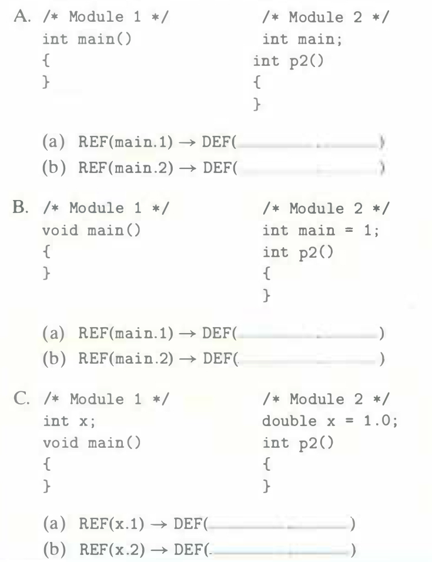

# Practice Problem 7.2 (solution page 718)
In this problem, let `REF(x.i)` $\rightarrow$ `DEF(x.k)` denote that the linker will associate an arbitrary reference to symbol x in module i to the definition of x in module k. For each example that follows, use this notation to indicate how the linker would resolve references to the multiply-defined symbol in each module. If there is a link-time error (rule 1), write "ERROR". If the linker arbitrarily chooses one of the definitions (rule 3), write "UNKNOWN".

## Solution:

- A.
    - (a) `REF(main.1)` $\rightarrow$ `DEF(main.1)`
    - (b) `REF(main.2)` $\rightarrow$ `DEF(main.1)`

- B. ERROR

- C. 
    - (a) `REF(x.1)` $\rightarrow$ `DEF(x.2)`
    - (a) `REF(x.2)` $\rightarrow$ `DEF(x.2)`