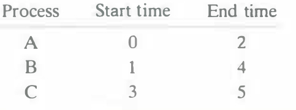
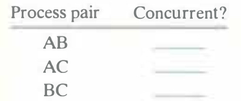
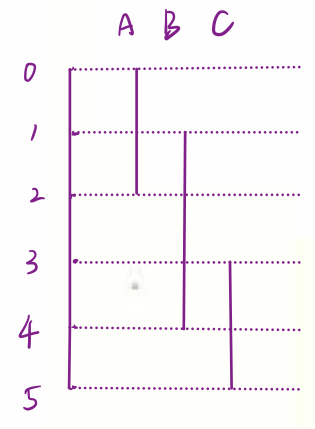

# Practice Problem 8.1 (solution page 795)
Consider three processes with the following starting and ending times:

For each pair of processes, indicate whether they run concurrently (Y) or not (N):

## Solution:

Process pair | Concurrent?
-|-
AB|Y
AC|N
BC|Y