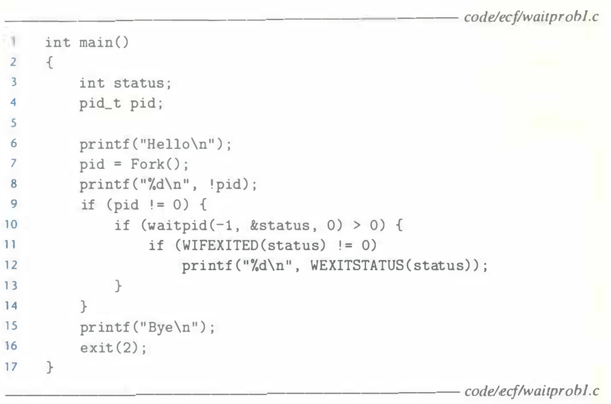
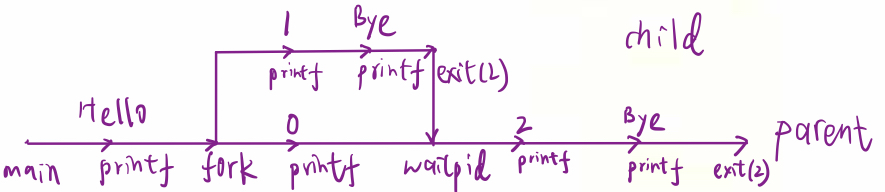

# Practice Problem 8.4 (solution page 797)
Consider the following program:



A. How many output lines does this program generate?

B. What is one possible ordering of these output lines?

## Solution:
- Process graph:

    

- A. 6
- B.

    ```
    Hello
    0
    1
    Bye
    2
    Bye
    ```