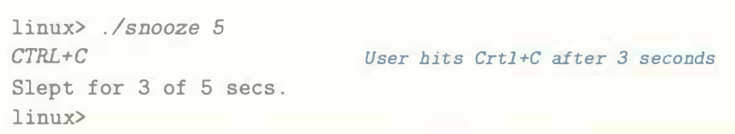

# Practice Problem 8.7 (solution page 798)
Write a program called `snooze` that takes a single command-line argument, calls the `snooze` function from Problem 8.5 with this argument, and then terminates.
Write your program so that the user can interrupt the `snooze` function by typing
Ctrl+C at the keyboard. For example:

## Solution:

Code: [snooze](../../problems/8/8.7_snooze.c)