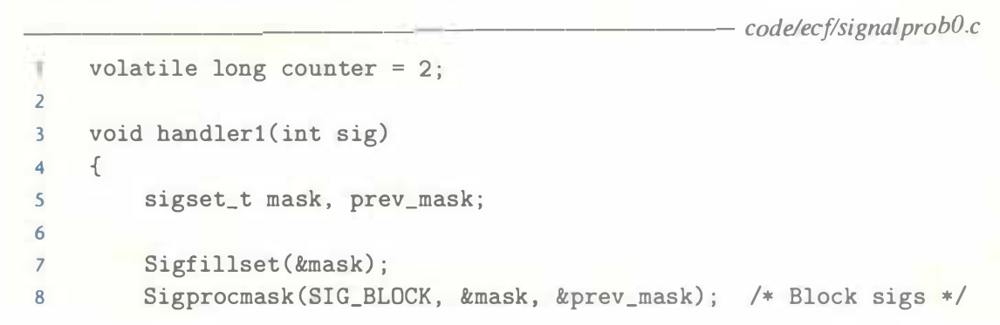
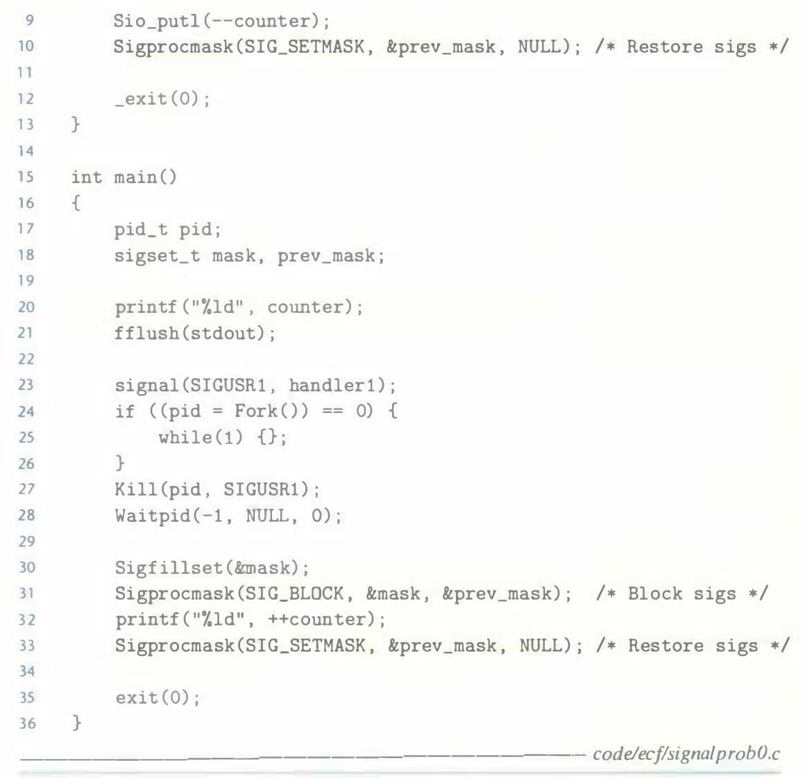

# Practice Problem 8.8 (solution page 799)
What is the output of the following program?

## Solution:
- Output: string ~~"212"~~ "213"
- Before `fork`, the main routine installs the signal handler.
- The child process also inherits the signal handler.
- After `fork`, global variable `counter` duplicates, one is in the parent process, the other is in the child process.
- Line 27, the parent delivers the `SIGUSR1` to the child process which triggers the signal handler belonging to the child process, and print `1`
- Line 32, the `counter` is in the parent process which is not affected by the child, print `3`