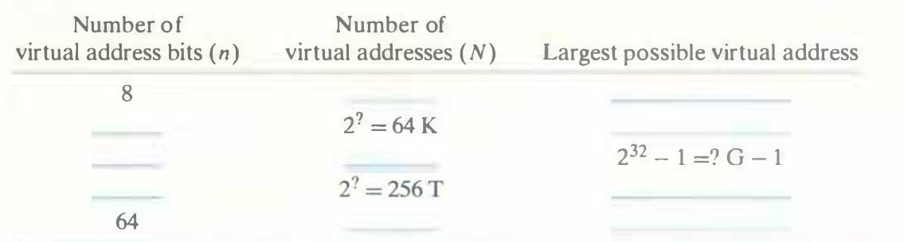

# Practice Problem 9.1 (solution page 880)
Complete the following table, filling in the missing entries and replacing each question mark with the appropriate integer. Use the following units: $K = 2^{10}$ (kilo), $M = 2^{20}$ (mega), $G = 2^{30}$ (giga), $T = 2^{40}$ (tera), $P= 2^{50}$ (peta), or $E = 2^{60}$ (exa).

## Solution:

Number of virtual address bits ($n$)|Number of virtual addresses ($N$)|Largest possible virtual address
-|-|-
8|$2^8=256$|$2^8-1=255$
16|$2^{16}=64K$|$2^{16}-1=64K-1$
32|$2^{32}=4G$|$2^{32}-1=4G-1$
48|$2^{48}=256T$|$2^{48}-1=256T-1$
64|$2^{64}=16E$|$2^{64}-1=16E-1$