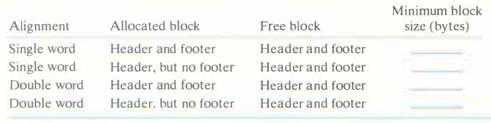

# Practice Problem 9.7 (solution page 883)
Determine the minimum block size for each of the following combinations of alignment requirements and block formats. Assumptions: Implicit free list, zero-size payloads are not allowed, and headers and footers are stored in 4-byte words.

## Solution:
Alignment|Allocated block|Free block|Minimum block size (bytes)
-|-|-|-
Single word|Header and footer|Header and footer|12
Single word|Header, but no footer|Header and footer|8
Double word|Header and footer|Header and footer|16
Double word|Header, but no footer|Header and footer|8